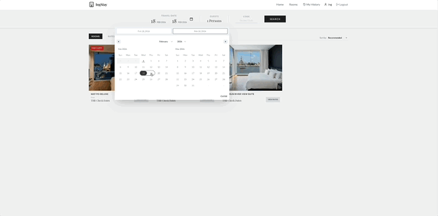
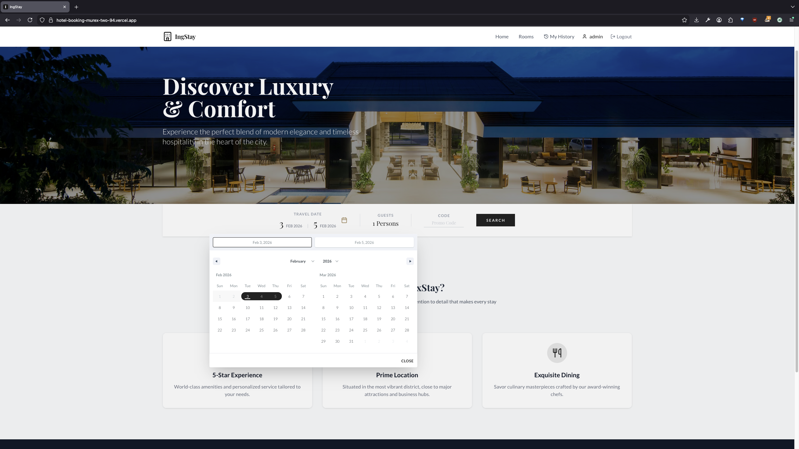
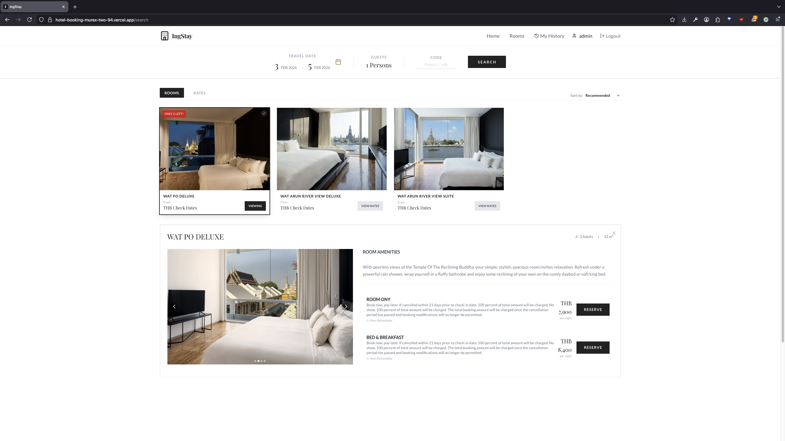
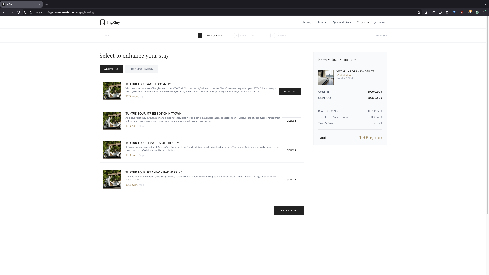
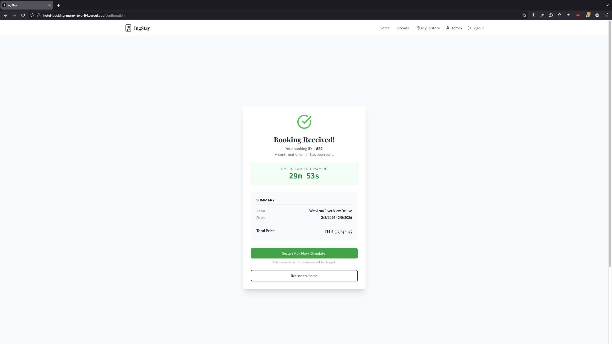
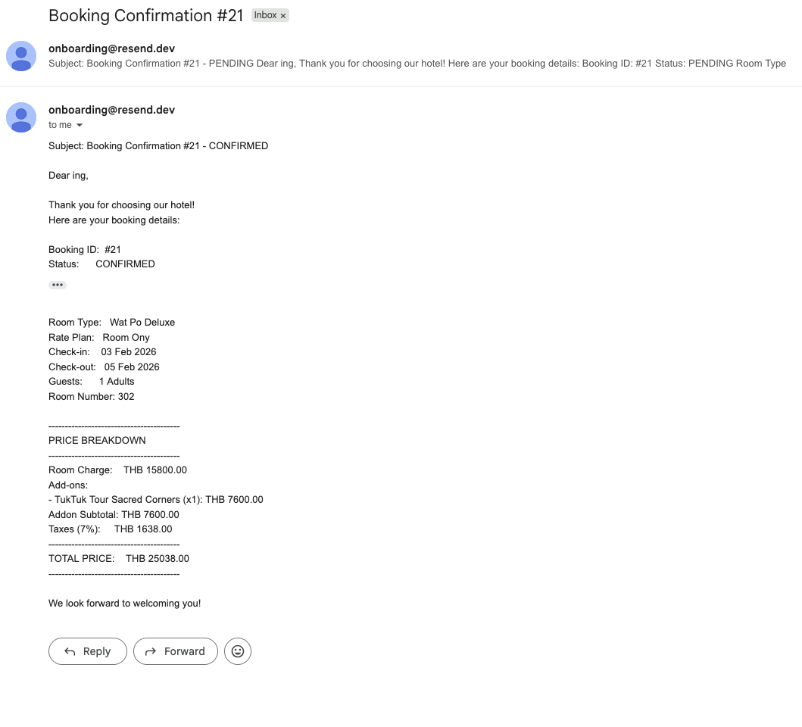
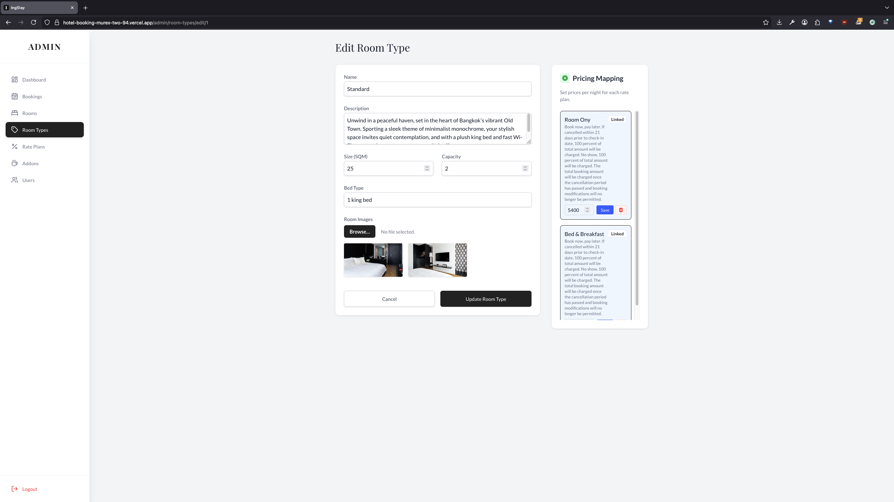
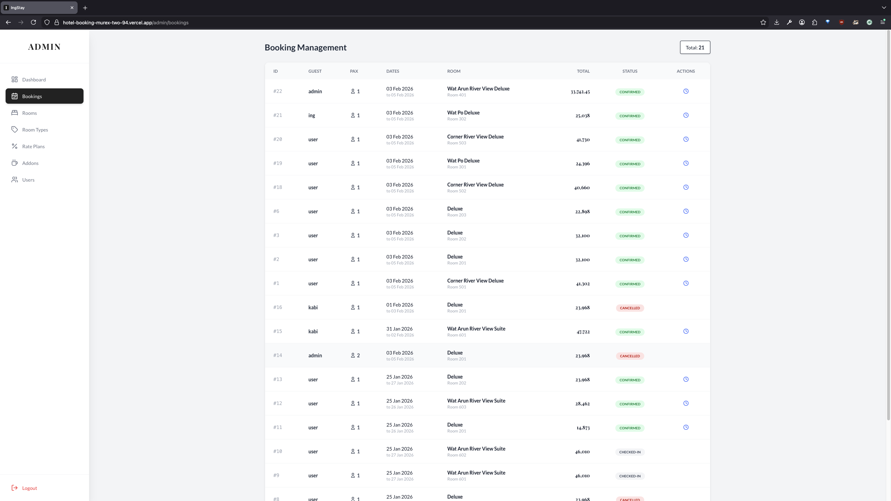

# 🏨 IngStay - Luxury Hotel Booking System

**A full-stack hotel reservation platform built with Clean Architecture Principles.**

[](https://hotel-booking-murex-two-94.vercel.app/)
[](https://hotelbooking-3d17.onrender.com)

---

## 📖 Introduction to the Project
**IngStay** is a robust web application designed to simulate a real-world hotel booking experience. It bridges the gap between a seamless user interface for guests and a powerful management dashboard for hotel administrators.

This project was built to demonstrate proficiency in **Modern Web Development**, **System Design**, and **Backend Engineering**, utilizing a microservice-ready structure (Hexagonal Architecture) to ensure scalability and maintainability.

---

## 🛠️ Technology Stack (Tech Stack)

### **Frontend (Client-Side)**
- **Framework:** React.js (Vite)
- **State Management:** Redux Toolkit (Complex state: Auth, Booking Flow, Room Selection)
- **Styling:** Tailwind CSS (Responsive Design, Mobile-First)
- **Routing:** React Router v6
- **HTTP Client:** Axios with Interceptors

### **Backend (Server-Side)**
- **Language:** Go (Golang) v1.22+
- **Framework:** Fiber (High-performance web framework)
- **Architecture:** **Hexagonal Architecture (Ports & Adapters)**
  - Decoupled Core Business Logic from External dependencies (DB, Web, Email).
- **Authentication:** JWT (JSON Web Tokens) with Secure HTTP-Only Cookies.
- **Security:** CSRF Protection, Password Hashing (Bcrypt), Rate Limiting.

### **Database & Infrastructure**
- **Database:** PostgreSQL (Hosted on Supabase)
- **ORM/Query:** SQLx (Type-safe SQL queries)
- **Deployment:**
  - **Frontend:** Vercel (CI/CD)
  - **Backend:** Render (Dockerized)
  - **Database:** Supabase Cloud
- **Containerization:** Docker & Docker Compose

---

## ✨ Key Features

### 👤 Guest Features
- **Browse & Search:** Filter rooms by date, capacity, and price.
- **Dynamic Pricing:** Real-time price calculation based on Rate Plans (e.g., Non-Refundable vs. Free Cancel).
- **Advanced Booking Wizard:** Multi-step booking process (Select Room -> Add-ons -> Guest Info -> Payment).
- **Payment Simulation:** Realistic mocked payment flow with QR Code generation, simulating asynchronous transaction status updates and webhook handling.
- **Booking History:** View past and upcoming reservations.

### 🛡️ Admin Dashboard
- **Room Management:** CRUD operations for Rooms, Room Types, and Amenities.
- **Rate Management:** Create sophisticated pricing strategies (Rate Plans).
- **Price Calendar:** Update room prices dynamically per rate plan.
- **Booking Oversight:** View all customer bookings and manage statuses.
- **Analytics:** Dashboard overview of active bookings and revenue.

### 📸 Preview

<div align="center">
  
</div>

<br />

| 🔍 Search & Home | 🛌 Room Details & Search |
| :---: | :---: |
|  |  |
| **Elegant Home UI** | **Rich Search Experience** |

| ➕ Booking Add-ons | 💳 Secure Payment |
| :---: | :---: |
|  |  |
| **Extra Services Selection** | **Payment Simulation** |

| 🧾 Booking Confirmation | 🛠️ Admin: Room Types |
| :---: | :---: |
|  |  |
| **Complete Reservation Details** | **Room Management** |

| 📊 Admin: Bookings |
| :---: |
|  |
| **Operational Dashboard** |

---

## 🏗️ System Architecture

This project strictly follows **Hexagonal Architecture (Ports and Adapters)** to keep the codebase clean and testable.

```
backend/
├── cmd/                # Entry points (main.go)
├── internal/
│   ├── core/           # Business Logic (Pure Go, No external deps)
│   │   ├── domain/     # Enterprise Entities (User, Booking, Room)
│   │   ├── ports/      # Interfaces (Repository & Service definitions)
│   │   └── services/   # Business Use Cases (BookingService_impl)
│   ├── adapters/       # Implementation details
│   │   ├── primary/    # Driving Adapters (Web Handlers, CLI)
│   │   └── secondary/  # Driven Adapters (PostgreSQL, Email, Logs)
```

This structure allows us to easily swap out databases (e.g., Postgres -> MySQL) or delivery methods (e.g., HTTP -> gRPC) without touching the core business logic.

---

## 🚀 How to Run Locally

### Prerequisites
- Go 1.22+
- Node.js & npm
- PostgreSQL
- Docker (Optional)

### 1. Clone the Repository
```bash
git clone https://github.com/ingwrok/hotelBooking.git
cd hotelBooking
```

### 2. Backend Setup
```bash
cd backend
cp .env.example .env
# Edit .env with your DB credentials
go mod tidy
go run cmd/http/main.go
```

### 3. Frontend Setup
```bash
cd frontend
npm install
npm run dev
```

The app will launch at `http://localhost:5173`.

---

## ⚠️ Known Limitations (For Reviewers)

1.  **Email Delivery (Demo Mode):**
    - The system uses **Resend (Free Tier)** for email delivery.
    - **Limitation:** Emails can ONLY be sent to the *Verified Owner Address* due to free tier restrictions.
    - **Note:** If you test the booking flow using a different email, the system will log the email content to the console but will *override* the recipient to the admin's email to ensure delivery success for demonstration purposes.

---

## 📞 Contact & Socials

| Channel | Contact Detail |
| :--- | :--- |
| **Email** | [ingzawork@gmail.com](mailto:ingzawork@gmail.com) |
| **GitHub** | [@ingwrok](https://github.com/ingwrok) |
| **Line ID** | [ingza2626](https://line.me/ti/p/~ingza2626) |
| **Phone** | [+66 98 885 2839](tel:+66988852839) |